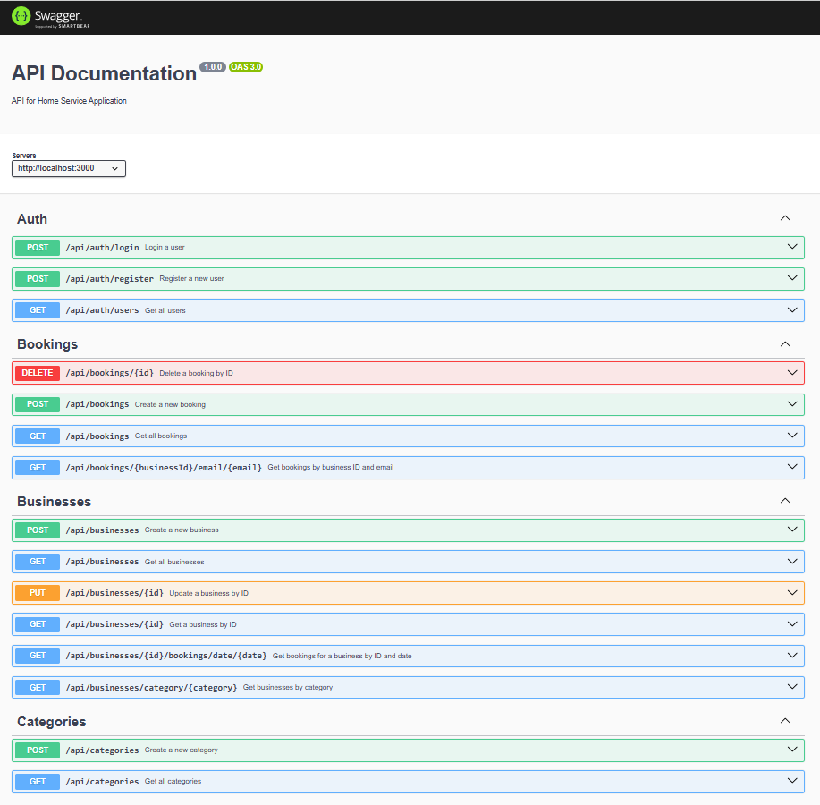
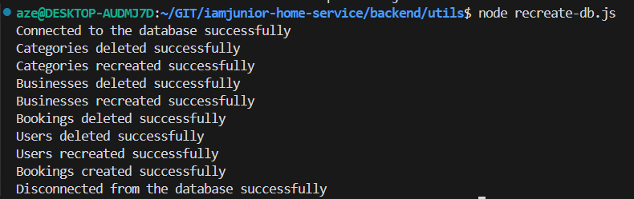
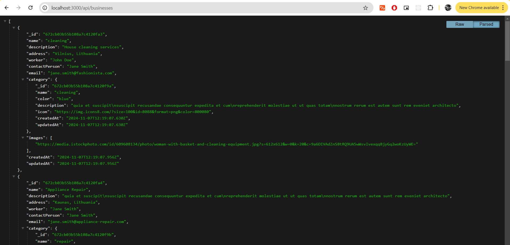
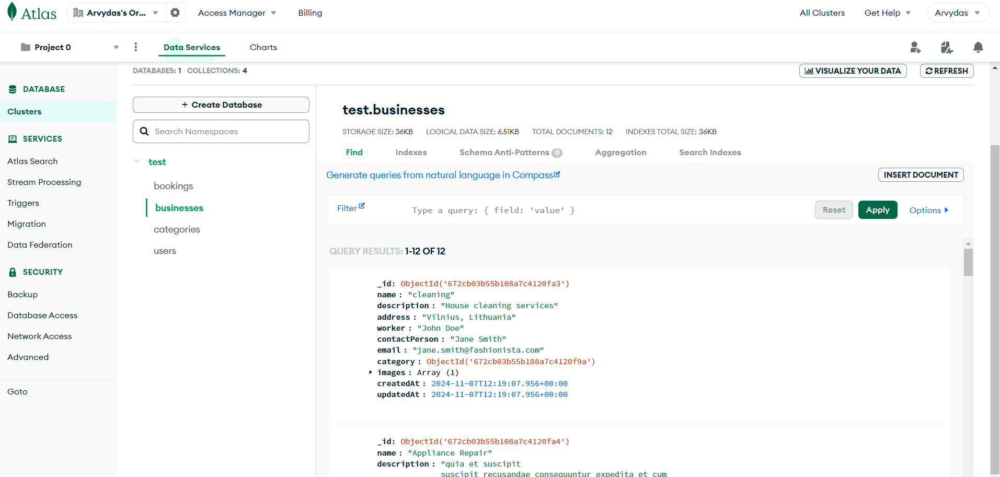

- [iamjunior-home-service (backend)](#iamjunior-home-service-backend)
- [BONUS tasks](#bonus-tasks)
- [Uzduotys](#uzduotys)
  - [Node.js ir Express pagrindai](#nodejs-ir-express-pagrindai)
    - [Home service aplikacijos API](#home-service-aplikacijos-api)
    - [Duomenų Modeliai:](#duomenų-modeliai)
    - [API kuriuos reikia įgyvendinti:](#api-kuriuos-reikia-įgyvendinti)
      - [1. Kategorijos](#1-kategorijos)
      - [2. Įmonės](#2-įmonės)
      - [3. Užsakymai](#3-užsakymai)
      - [Papildomos funkcijos, kurias reikia įgyvendinti:](#papildomos-funkcijos-kurias-reikia-įgyvendinti)
  - [MongoDB ir Mongoose](#mongodb-ir-mongoose)
  - [Autentifikacija Node.js](#autentifikacija-nodejs)
  - [ESlint ir Prettier](#eslint-ir-prettier)

# iamjunior-home-service (backend)

To know how the initial backend node project was built(simply the api, but can see the commit history), check out this repo - https://github.com/azegas/iamjunior-nodejs

# BONUS tasks

- [x] Swagger API docs - https://www.youtube.com/watch?v=eiSem0cqaN0&ab_channel=KrisFoster
- [x] Automatically recreate database data from scratch

Swagger API docs screenshot:

Recreate database screenshot:

Api endpoint screenshot:

MongoDB database screenshot:

# Uzduotys

## Node.js ir Express pagrindai

### Home service aplikacijos API

Sukurti RESTful API naudojant Express.js, skirtą valdyti kategorijas, įmones ir užsakymus.

### Duomenų Modeliai:

- [x] Kategorijos: Kiekviena kategorija turi ID, pavadinimą, fono spalvą ir ikonos URL.
- [x] Įmonės: Kiekvienas įmonės įrašas apima tokius duomenis kaip ID, pavadinimas, aprašymas, adresas, kategorija, kontaktinis asmuo, el. paštas ir nuotraukos.
- [x] Užsakymai: Sekami užsakymai su tokiomis detalėmis kaip ID, įmonės ID, data, laikas, vartotojo el. paštas, vartotojo vardas ir statusas.

### API kuriuos reikia įgyvendinti:

#### 1. Kategorijos

- [x] GET /categories: Gauna visas kategorijas.
- [x] POST /categories: Sukuria naują kategoriją.

#### 2. Įmonės

- [x] GET /businesses: Gauna visas įmones.
- [x] GET /businesses/category/:category: Gauna visas įmones, priklausančias nurodytai kategorijai.
- [x] GET /businesses/:id: Gauna konkrečią įmonę pagal ID.
- [x] POST /businesses: Prideda naują įmonę į sąrašą. Užtikrinti, kad būtų pateikti visi būtini laukai.
- [x] PUT /businesses/:id: Atnaujina esamą įmonę. Patikrinti, ar įmonė su nurodytu ID egzistuoja, prieš atnaujinant.
- [x] GET /businesses/:businessId/bookings/date/:date: Gauna visus užsakymus konkrečiai įmonei nurodytą dieną.

#### 3. Užsakymai

- [x] GET /bookings/user/:email: Gauna visus užsakymus, susijusius su konkretaus vartotojo el. pašto adresu.
- [x] POST /bookings: Sukuria naują užsakymą. Užtikrinti, kad būtų pateikti visi laukai.
- [x] DELETE /bookings/:id: Ištrina konkretų užsakymą.

#### Papildomos funkcijos, kurias reikia įgyvendinti:

- [x] Error handling: Įgyvendinti išsamią klaidų tvarkymo sistemą, kad būtų aiškiai pateikiami pranešimai apie trūkstamus duomenis, netinkamas operacijas ir nesėkmingus veiksmus.
- [x] Data check: Užtikrinti, kad visi įvesties duomenys atitiktų tikėtinus formatus ir apribojimus prieš juos apdorojant.

## MongoDB ir Mongoose

- [x] Panaudoti 5 paskaitos kurtus API ir perdaryti juos naudojant MongoDB ir mongoose

## Autentifikacija Node.js

- [x] Pridėti User schemą su atitinkamais laukais
- [x] Panaudoti autentifikacijos metodus ir apsaugoti reikiamus API
- [x] Išskaidyti routes į skirtingus failus pvz. routes/bookingRoutes.js, routes/businessRoutes.js, routes/authRoutes.js

## ESlint ir Prettier

- [x] Integruoti ESlint ir atitikti visus ESlint reikalavimus
- [x] Integruoti Prettier ir suformatuoti visus failus
