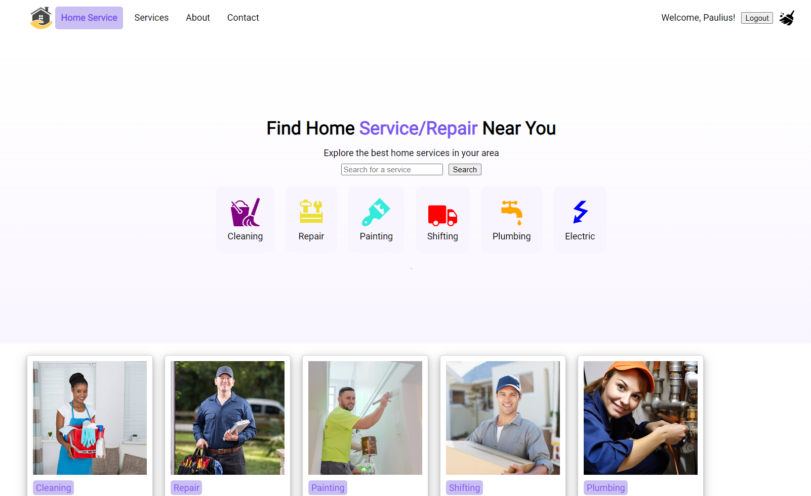
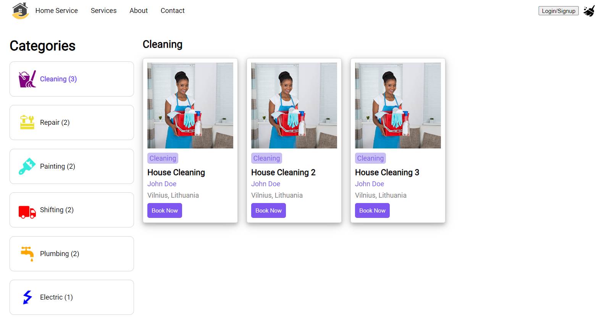
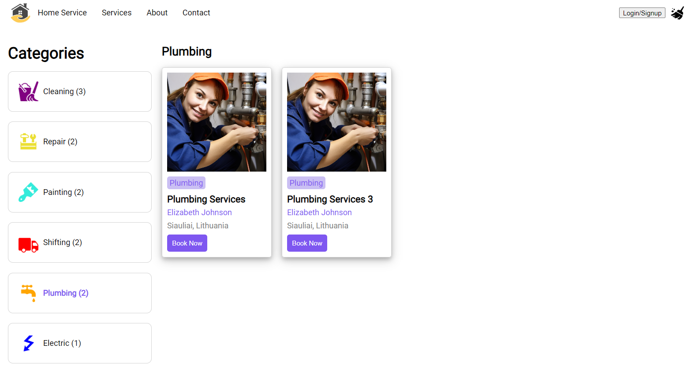
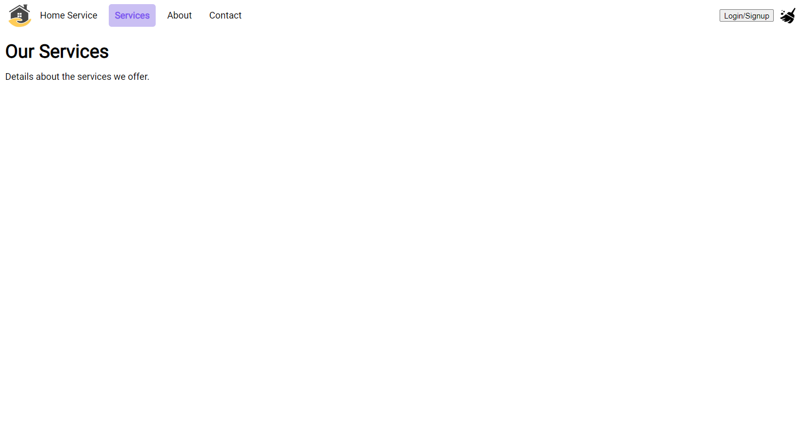
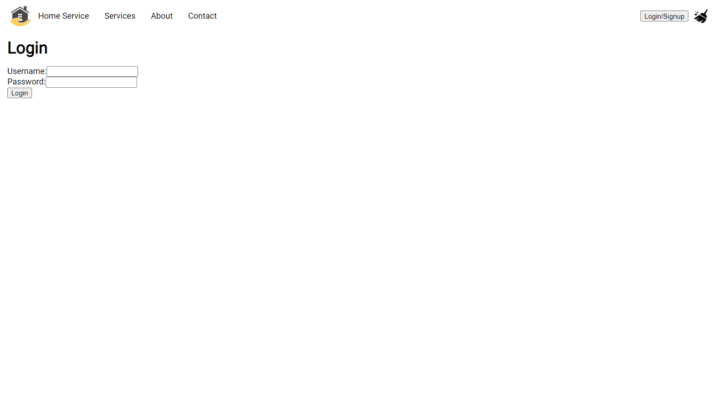

https://www.iamjunior.lt/front-end-akceleratorius-javascript course task

LIVE app - https://iamjunior-home-service.vercel.app/

Second presented version of the project.

Changes from https://github.com/azegas/iamjunior-home-service/tree/1-react-first-presentation:

- Prop drilling replaced with context
- json-server replaced with db.json file
- still no responsivness
- still no functional search
- functional vercel deployment
- search page reordered
- spinner logic improved
- error handling improved
- login functionality implemented
- register form created(no register functionality yet)







# To run the project

```bash
git clone https://github.com/azegas/iamjunior-home-service
# choose a correct branch
cd iamjunior-home-service
npm i
npm run dev
# open http://localhost:5173/ in your browser to preview the site
```

# DONE bonus features
- [x] Mimicking loading functionality - fetching what is "static" quickly, fetching businesses with setTimeout to imitate loading, so the user is aware, that he will get some information soon. Not having a long initial loading screen.
- [x] json server to to mimic and provide fake data
- [x] active class both in menu and in service search
- [x] loading effect faked in useFetchFile hook by adding setTimeout
- [x] catch error in useFetchFile hook and display it in the component
- [x] go to individual business pages
- [x] 404 page
- [x] favicon
- [x] deployed to vercel

# TODO bonus features
- [ ] Functional search in homepage
- [ ] pagination (100 businesses)
- [ ] absolute paths instead of ../../
- [ ] dark mode - https://usehooks-ts.com/react-hook/use-dark-mode

# Actual project requirements
## React ekosistema, JSX sintaksė ir state valdymas
1. [x] Topbar komponentas: Tai turėtų apimti logotipą ir navigacijos meniu, kuris kol kas gali būti statinis vėliau bus įtrauktas react-router.
2. [x] Paieškos juosta: Centrinė paieškos juosta su mygtuku. Nors interaktyvi paieška dar nebus įgyvendinta, svarbu paruošti input elementą ir paieškos mygtuką.
3. [x] Kategorijos kortelė: Paslaugų sekcijoje, kiekviena paslauga (pvz., “Cleaning”, “Repair”) turėtų būti atvaizduojama kaip atskiras komponentas su ikona ir tekstiniu aprašymu.
4. [x] Stilius: SCSS modules arba Styled-components
5. [ ] Responsive design (optional): Naudoti CSS media queries, kad puslapis tinkamai atrodytų įvairaus dydžio įrenginiuose.
6. [x] Būsenos valdymas: Nors šioje užduotyje būsenos valdymo galimybių nebus daug, verta paruošti būsimam funkcionalumui su useState. Galima paruošti search inputui.

## Komponento gyvavimo ciklai ir react-router-dom
1. [x] Topbar komponentas: Įgyvendinti navigaciją react-router-dom pagalba tarp puslapių Home, Services ir About Us. Naudoti Link komponentą
2. [x] Login mygtukas: Paspaudus Login/Sign Up mygtuką naviguoti į Login puslapį naudojant useNavigate hooką
3. [x] Paslaugų kortelė: Paspaudus ant kortelės naviguoti į /search/:category routą
4. [x] Routes: Įgyivendinti naujus maršrutus (routes) tokius kaip: Home, Services, About Us, Login, Register, SearchCategory

## Custom Hooks
1. [x] Categories komponentas: Įgyvendinti kategorijų pasirinkimą. Paspaudus ant kitos kategorijos turi pasikeisti ir URL iš /search/cleaning į /search/repair
2. [x] Filtravimas: Išfiltruoti tik tas paslaugas kurios įeina į kategoriją
3. [ ] Save as favorite (optional): Pridėti ant kortelės širdelės arba žymos ikoną, kurią nuspaudus būtų išsaugotą paslauga į localStorage. Galite naudoti useLocalStorage hooksą.

## React Context ir zustand
1. [x] Login: Sukurti /login route, įgyvendinti savo norimą dizainą ir pridėti inputų validaciją.
2. [x] Redirect: Suvedus inputus ir paspaudus Login mygtuką išsaugoti userio informaciją su useContext ir localStorage bei redirectint į pagrindinį / route
3. [x] Topbar komponentas: Atnaujinti komponento state kai asmuo yra prisijungęs
4. [x] Register (optional): Įgyvendinti /register route ir savo norimą dizainą
